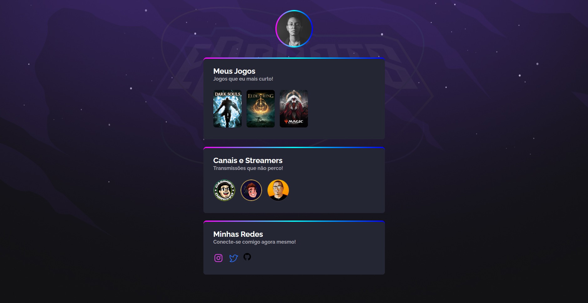

# NLW eSports

>Trilha Explorer

Projeto feito para estudos no evento Next Level Week da Rocketseat.

[🔗 Clique para acessar](https://jotalimas.github.io/nlw/)

## 🛠 Tecnologias

- HTML;
- CSS;
- Git e Github.

## 📚 Princípios estudados

- Prototipagem com Figma;
- Princípios de UI/UX Design;
- Marcação de página com HTML;
- Estilos e animações com CSS;
- Como subir um projeto para um respositório remoto;
- Organização e estrutura de pastas;
- Readme para projetos feito em Markdown.